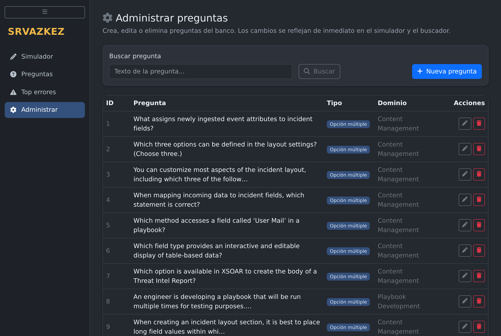
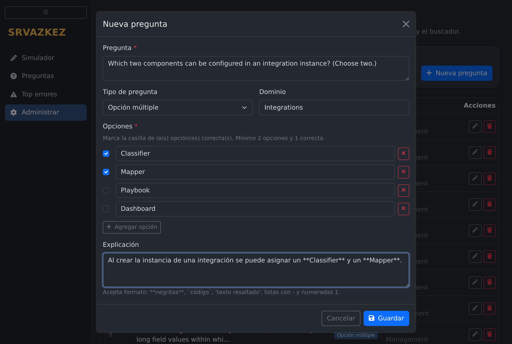
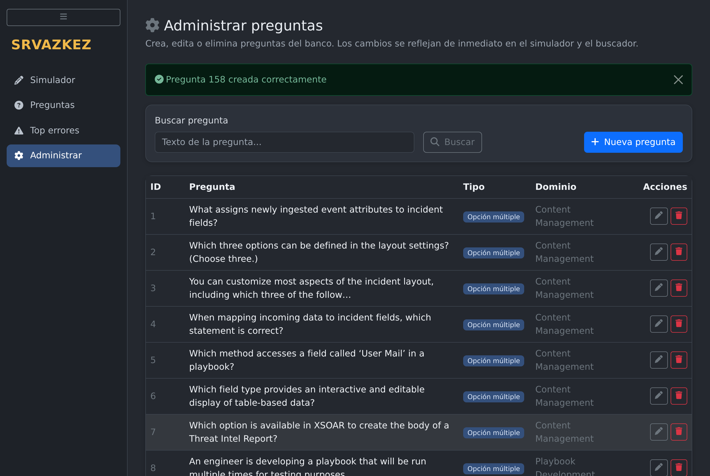
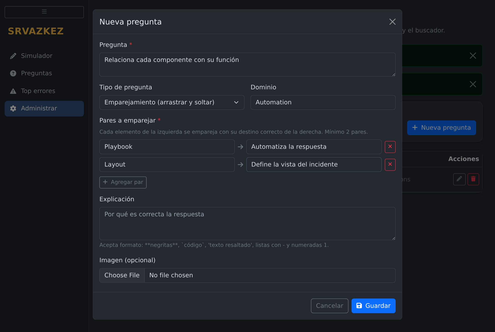
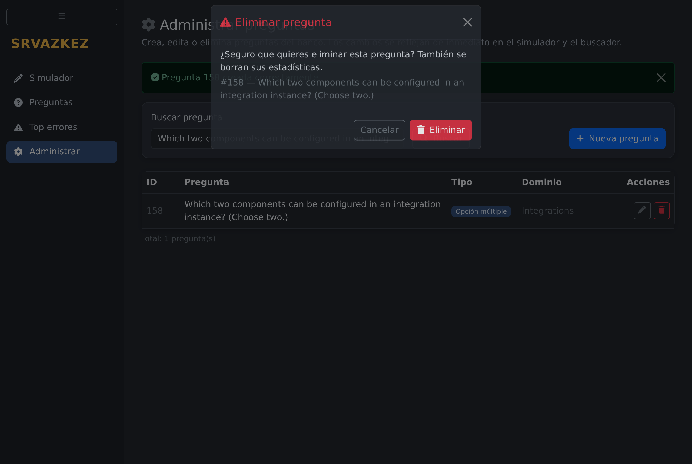

# ExamSimulator

**AKA (Avanset Clone)**

Este es un clon de la corporación Avanset, los cuales cobran mucho y realmente quería editar mis preguntas sin pagar un riñón por él. Así que si te sirve, adelante. 🎓

Simulador de exámenes de certificación (pensado originalmente para el **PCSAE** de Palo Alto, pero sirve para cualquier banco de preguntas). Incluye examen cronometrado, repaso de errores, buscador de preguntas y estadísticas por dominio.

---

## ✨ Características

- **Simulador de examen** con preguntas aleatorias, cronómetro configurable (120 min por defecto) y envío automático al agotarse el tiempo.
- **Modo "Estudiar mis errores"**: genera un examen solo con las preguntas que más has fallado.
- **Buscador de preguntas** con resaltado del término y paginación.
- **Top de errores**: lista tus preguntas más falladas con su explicación.
- Soporta preguntas de **opción múltiple** (una o varias respuestas) y de **emparejamiento** (arrastrar y soltar).
- Resultados con calificación, resumen por dominio y explicación de cada pregunta.
- **Administrador de preguntas**: formulario para crear, editar y eliminar preguntas desde la propia interfaz, sin tocar la base de datos.
- **Métricas de progreso**: evolución de tus calificaciones examen a examen (con la línea del 72% aprobatorio), acierto acumulado por dominio e historial de intentos.

## 🧱 Tecnologías

| Componente     | Tecnología                                  |
|----------------|---------------------------------------------|
| API            | Python + FastAPI + Uvicorn                   |
| Base de datos  | MongoDB 6                                    |
| Administrador BD | Mongo Express                             |
| Frontend       | HTML + Bootstrap 5 + JavaScript vanilla      |
| Orquestación   | Docker Compose                               |

## 📁 Estructura del proyecto

```
AvansetClone/
├── main.py               # API FastAPI (endpoints del examen)
├── db.py                 # Conexión a MongoDB
├── models.py             # Modelos de datos (Pydantic)
├── requirements.txt      # Dependencias de Python
├── docker-compose.yml    # App + MongoDB + seed + Mongo Express
├── .env.example          # Variables configurables de Docker Compose
├── data/
│   ├── preguntas.json    # Banco de preguntas
│   └── bulk_insert.py    # Script para cargar las preguntas a MongoDB
├── tests/
│   └── test_api.py       # Pruebas de integración de la API
└── frontend/
    ├── index.html        # Simulador de examen
    ├── preguntas.html    # Buscador de preguntas
    ├── preguntasmalas.html # Top de errores
    ├── metricas.html     # Métricas de progreso (gráficas)
    ├── admin.html        # Administrador de preguntas (CRUD)
    ├── style.css
    ├── ARCHITECTURE.md   # Estrategia de capas del frontend
    └── js/
        ├── core/         # API, DOM, formato, tema, namespace
        ├── components/   # Componentes reutilizables de UI
        └── pages/        # Lógica específica por pantalla
```

---

## ✅ Requisitos previos

Antes de empezar necesitas tener instalado:

1. **Docker y Docker Compose** — para levantar todo el proyecto.
   👉 [Instalar Docker Desktop](https://docs.docker.com/get-docker/) (Windows/Mac) o [Docker Engine](https://docs.docker.com/engine/install/) (Linux).
2. **Git** — para clonar el proyecto.
   👉 [Descargar Git](https://git-scm.com/downloads).

Opcional, solo si quieres correr la API sin Docker:

3. **Python 3.10 o superior**.
   👉 [Descargar Python](https://www.python.org/downloads/). En Windows, marca la casilla *"Add Python to PATH"* durante la instalación.

Para verificar que todo está instalado, abre una terminal y ejecuta:

```bash
docker --version
docker compose version
git --version
```

Si los tres comandos responden con una versión, estás listo.

---

## 🚀 Levantar todo con Docker Compose

### 1. Clonar el proyecto

```bash
git clone <URL-de-este-repositorio>
cd AvansetClone
```

### 2. Configurar variables opcionales

El proyecto ya trae defaults. Puedes arrancarlo sin crear `.env`.

Si quieres cambiar puertos, usuarios o contraseñas:

```bash
cp .env.example .env
```

Edita `.env` según necesites.

### 3. Levantar todo

```bash
docker compose up --build
```

Esto levanta:

- **App FastAPI + frontend** en `http://localhost:8000`.
- **MongoDB** en `localhost:27017`.
- **Seed** de preguntas iniciales desde `data/preguntas.json`.
- **Mongo Express** en `http://localhost:8081`.

Verifica que estén corriendo:

```bash
docker compose ps
```

`app`, `mongo` y `mongo-express` deben aparecer como `running`. `seed` debe aparecer como completado/exited con código `0`.

### 4. Abrir la aplicación

Abre tu navegador en:

👉 **http://localhost:8000**

Te redirige automáticamente al simulador.

Para detener:

```bash
docker compose down
```

Los datos de MongoDB se conservan en el volumen `mongo-data`. Si quieres borrar todo y empezar desde cero:

```bash
docker compose down -v
```

---

## ⚙️ Variables de configuración

Puedes copiarlas desde `.env.example` a `.env`.

| Variable | Default | Para qué sirve |
|----------|---------|----------------|
| `APP_PORT` | `8000` | Puerto donde se publica la aplicación FastAPI/frontend. |
| `MONGO_PORT` | `27017` | Puerto local de MongoDB. |
| `MONGO_EXPRESS_PORT` | `8081` | Puerto local de Mongo Express. |
| `MONGO_DB` | `simulador` | Nombre de la base de datos. |
| `MONGO_USER` | `admin` | Usuario root de MongoDB. |
| `MONGO_PASSWORD` | `secret` | Contraseña root de MongoDB. |
| `MONGO_EXPRESS_USER` | `admin` | Usuario para entrar a Mongo Express. |
| `MONGO_EXPRESS_PASSWORD` | `pass` | Contraseña para entrar a Mongo Express. |

Ejemplo de `.env`:

```env
APP_PORT=8000
MONGO_PORT=27017
MONGO_EXPRESS_PORT=8081
MONGO_DB=simulador
MONGO_USER=admin
MONGO_PASSWORD=secret
MONGO_EXPRESS_USER=admin
MONGO_EXPRESS_PASSWORD=pass
```

Si cambias `MONGO_USER` o `MONGO_PASSWORD` después de haber creado el volumen de Mongo, borra el volumen con `docker compose down -v` para que Mongo inicialice otra vez con las nuevas credenciales.

---

## 🌐 URLs útiles

| URL                          | Qué es                                        |
|------------------------------|-----------------------------------------------|
| http://localhost:8000        | La aplicación (interfaz web)                   |
| http://localhost:8000/docs   | Documentación interactiva de la API (Swagger)  |
| http://localhost:8081        | Mongo Express (admin de la base de datos)      |

> 🔑 Mongo Express pide usuario y contraseña al entrar: por defecto son `admin` / `pass`.

---

## 🧑‍💻 Modo desarrollo local sin Docker para la API

Docker Compose es la forma recomendada. Si quieres correr la API directamente en tu máquina:

1. Levanta solo MongoDB:

```bash
docker compose up -d mongo mongo-express
```

2. Crea el entorno virtual e instala dependencias:

```bash
python3 -m venv venv
source venv/bin/activate
pip install -r requirements.txt
```

En Windows PowerShell:

```powershell
python -m venv venv
.\venv\Scripts\Activate.ps1
pip install -r requirements.txt
```

3. Carga o actualiza el banco de preguntas:

```bash
python data/bulk_insert.py
```

El seed es idempotente: si las preguntas ya existen por `qid`, no las duplica.

4. Arranca la API:

```bash
uvicorn main:app --reload --host 0.0.0.0 --port 8000
```

Si tu Mongo local usa otros valores, exporta variables antes de arrancar:

```bash
export MONGO_HOST=localhost
export MONGO_PORT=27017
export MONGO_DB=simulador
export MONGO_USER=admin
export MONGO_PASSWORD=secret
```

## 🕹️ Cómo se usa

1. **Simulador** — Elige cuántas preguntas quieres y el tiempo límite (por defecto 95 preguntas y 120 minutos, como el examen real). Al terminar, o si se agota el tiempo, se envían tus respuestas y ves tu calificación con el detalle de cada pregunta y un resumen por dominio.
2. **Preguntas** — Busca en todo el banco por palabra clave. Las respuestas correctas se marcan en verde.
3. **Top errores** — Las preguntas que más has fallado, ordenadas de peor a mejor, con su explicación. Ideal para el repaso final.
4. **Métricas** — Tu progreso en el tiempo: tarjetas de resumen (exámenes, promedio, mejor y último), gráfica de evolución con la meta aprobatoria del 72%, acierto por dominio e historial detallado. Funciona en tema claro y oscuro.
5. **Administrar** — Crea, edita y elimina preguntas con un formulario: opciones dinámicas, pares de emparejamiento, imagen opcional y validación antes de guardar.

## ➕ Manual: cómo agregar preguntas

### Dos formas de hacerlo

| Método | Cuándo usarlo |
|--------|---------------|
| **Interfaz → Administrar** (recomendado) | Para el día a día. El formulario valida todo antes de guardar y no necesitas conocer el formato interno. |
| **API → http://localhost:8000/docs** | Para cargas masivas o si prefieres trabajar con JSON directo (`POST /questions` → *"Try it out"*). |

En ambos casos **el `qid` se genera automáticamente** (el consecutivo siguiente); nunca lo mandes tú.

### Usar el formulario de la interfaz (paso a paso)

#### 1. Entra a la sección Administrar

En la barra lateral haz clic en **Administrar**. Verás el listado completo del banco con su ID, tipo y dominio. Desde aquí puedes buscar por texto, y cada fila tiene sus botones de **editar** (lápiz) y **eliminar** (bote de basura):



#### 2. Crea una pregunta con "Nueva pregunta"

Haz clic en el botón azul **+ Nueva pregunta**. Se abre el formulario; así se ve llenado para una pregunta de opción múltiple con **dos respuestas correctas** (observa las casillas azules marcadas en *Classifier* y *Mapper* — eso es todo lo que necesitas para indicar las respuestas correctas, el sistema arma el resto):



Consejos al llenarlo:

- **Casillas de la izquierda** = respuestas correctas. Marca 1 para que el examen muestre radio buttons, o varias para que muestre checkboxes pidiendo ese número de respuestas.
- **Agregar opción** añade más filas; la ✕ roja quita una. Las filas que dejes vacías se ignoran.
- **Dominio** autocompleta con los dominios que ya existen, para no crear variantes por un error de dedo.
- **Imagen (opcional)**: elige el archivo y el formulario lo convierte a base64 por ti, con vista previa.

#### 3. Guarda y verifica

Al hacer clic en **Guardar**, el formulario valida (mínimo 2 opciones, al menos una correcta, sin repetidas...) y si algo falta te lo dice ahí mismo sin cerrar el modal. Si todo está bien, verás el aviso verde con el número asignado:



#### 4. Pregunta de emparejamiento

Si en **Tipo de pregunta** eliges *Emparejamiento*, el formulario cambia: en lugar de opciones capturas pares "elemento → destino correcto". En el examen, el usuario verá los elementos revueltos para arrastrarlos a su destino:



#### 5. Editar y eliminar

- El botón del **lápiz** abre el mismo formulario con los datos cargados; guarda y listo (el ID y las estadísticas se conservan).
- El botón del **bote de basura** pide confirmación antes de borrar, mostrándote cuál pregunta es. Recuerda: también se borran sus estadísticas de aciertos/fallos.



### Los campos de una pregunta

| Campo | Obligatorio | Descripción |
|-------|-------------|-------------|
| `question` | ✅ | El enunciado de la pregunta. |
| `type` | ✅ | `multiple_choice` (opción múltiple) o `match` (emparejamiento). |
| `options` | Solo en `multiple_choice` | Lista con todas las opciones que verá el usuario. |
| `answer` | ✅ | Ver detalle abajo: **lista** en opción múltiple, **diccionario** en match. |
| `match_items` / `match_targets` | Solo en `match` | Columna izquierda (lo que se arrastra) y derecha (donde se suelta). |
| `explanation` | Recomendado | Por qué es correcta la respuesta. Acepta formato (ver abajo). |
| `domain` | Recomendado | Categoría/dominio del examen. Se usa para el resumen de resultados por dominio. |
| `image_base64` | Opcional | Imagen en base64 **sin** el prefijo `data:image/...`. Desde el formulario solo eliges el archivo y él la convierte. |

---

### Caso 1: opción múltiple con UNA respuesta correcta

`answer` es una lista **con un solo elemento**:

```json
{
  "question": "What assigns newly ingested event attributes to incident fields?",
  "type": "multiple_choice",
  "options": ["Playbooks", "Classification", "Mapping", "Layouts"],
  "answer": ["Mapping"],
  "explanation": "Mapping se encarga de asignar los atributos a los campos del incidente.",
  "domain": "Incident Management"
}
```

**Cómo se comporta en el examen:** al haber una sola respuesta en `answer`, el simulador muestra la pregunta con **radio buttons** (selección única) y el letrero *"Selecciona una respuesta"*. El usuario solo puede marcar una opción.

### Caso 2: opción múltiple con VARIAS respuestas correctas ⚠️

Esta es la parte importante de la lógica de negocio. Si la pregunta tiene más de una respuesta correcta, **todas van dentro de la lista `answer`**:

```json
{
  "question": "Which two components can be configured in an integration instance? (Choose two.)",
  "type": "multiple_choice",
  "options": ["Classifier", "Mapper", "Playbook", "Dashboard"],
  "answer": ["Classifier", "Mapper"],
  "explanation": "Al crear la instancia de una integración se puede asignar un **Classifier** y un **Mapper**.",
  "domain": "Integrations"
}
```

Reglas que debes conocer al registrarlas:

1. **La cantidad de elementos en `answer` controla la interfaz.** Con 2 respuestas, el simulador muestra **checkboxes** y el letrero *"Selecciona 2 respuestas"*; con 3, pide 3, y así. Además bloquea que el usuario marque más casillas de las permitidas.
2. **Cada texto de `answer` debe ser IDÉNTICO a su opción en `options`** — mismas mayúsculas, espacios y acentos. Si escribes `"mapper"` en `answer` pero `"Mapper"` en `options`, la API rechaza la pregunta con error 422. Recomendación: copia y pega. (En el formulario de Administrar esto no puede pasar: solo marcas la casilla de la opción correcta.)
3. **La calificación es todo o nada.** El sistema compara el *conjunto* de respuestas del usuario contra el *conjunto* de `answer`: debe marcar **todas** las correctas y **ninguna** incorrecta para que cuente como acierto. No hay puntos parciales — igual que en el examen real.
4. **Las opciones se barajan** en cada examen. No escribas opciones que dependan de la posición, como *"A y B son correctas"*, porque el orden cambiará.

### Caso 3: emparejamiento (arrastrar y soltar)

`answer` es un **diccionario** donde cada llave es un elemento de `match_items` y su valor es el destino correcto de `match_targets`:

```json
{
  "question": "Relaciona cada componente con su función",
  "type": "match",
  "match_items": ["Playbook", "Layout"],
  "match_targets": ["Automatiza la respuesta", "Define la vista del incidente"],
  "answer": {
    "Playbook": "Automatiza la respuesta",
    "Layout": "Define la vista del incidente"
  },
  "domain": "Automation"
}
```

Reglas:

- Las **llaves** de `answer` deben ser exactamente los mismos textos que `match_items` (todas, sin faltar ni sobrar).
- Los **valores** de `answer` deben existir dentro de `match_targets`.
- En el formulario de Administrar solo capturas los pares "elemento → destino" y él arma las tres estructuras por ti.

### Formato en las explicaciones

Las explicaciones aceptan un mini-Markdown que la interfaz convierte a formato visual:

| Escribes | Se ve como |
|----------|------------|
| `**texto importante**` | **negritas** |
| `` `incident.fieldname` `` | código con fondo azul |
| `'src_ip'` (comillas simples) | también código — útil para nombres de campos |
| `- elemento` (una línea por viñeta) | lista con viñetas |
| `1. paso uno` | lista numerada |

### Errores comunes al registrar (validaciones de la API)

| Error 422 | Causa |
|-----------|-------|
| *"La respuesta debe ser una lista en preguntas de opción múltiple"* | Mandaste `answer` como texto o diccionario en una `multiple_choice`. |
| *"Todas las respuestas deben estar dentro de las opciones"* | Algún texto de `answer` no coincide exactamente con uno de `options`. |
| *"Faltan opciones en pregunta de opción múltiple"* | No mandaste `options`. |
| *"La respuesta debe ser un diccionario en preguntas de emparejamiento"* | Mandaste `answer` como lista en una `match`. |
| *"Las claves del diccionario deben coincidir con los 'match_items'"* | Las llaves de `answer` no son idénticas a `match_items`. |

### Editar y eliminar

- **Editar**: desde Administrar (botón del lápiz) o con `PUT /questions/{qid}`. El `qid` y las estadísticas de la pregunta se conservan.
- **Eliminar**: desde Administrar (botón del bote de basura, pide confirmación) o con `DELETE /questions/{qid}`. Ojo: **también borra las estadísticas** de esa pregunta (sus conteos de aciertos/fallos).

## 🔁 Uso diario (después de la primera instalación)

```bash
docker compose up --build
```

Para detener todo:

```bash
docker compose down
```

Para ver logs:

```bash
docker compose logs -f app
```

Para reiniciar limpio, borrando MongoDB y recargando preguntas desde `data/preguntas.json`:

```bash
docker compose down -v
docker compose up --build
```

---

## 🧩 Arquitectura del frontend

El frontend no usa framework ni build step, pero está separado por carpetas:

- `frontend/js/core`: infraestructura base (`api`, `dom`, `format`, `theme`, namespace).
- `frontend/js/components`: piezas reutilizables de interfaz.
- `frontend/js/pages`: lógica específica de cada pantalla.

La documentación completa está en [frontend/ARCHITECTURE.md](frontend/ARCHITECTURE.md).

---

## 🧪 Pruebas

El proyecto incluye pruebas de integración que validan el CRUD de preguntas, las validaciones del modelo, la generación y calificación de exámenes y la paginación. Necesitan que MongoDB y la API estén corriendo (pasos 2 y 5 de la instalación).

```bash
pip install -r requirements-dev.txt   # instala pytest y httpx (solo la primera vez)
pytest tests/ -v
```

Las pruebas crean preguntas temporales marcadas con `[TEST-...]` y las eliminan al terminar, así que no ensucian tu banco de preguntas.

---

## 🩹 Solución de problemas

**"Connection refused" al cargar preguntas o al abrir la app**
→ Revisa que los contenedores estén corriendo:

```bash
docker compose ps
docker compose logs -f app
```

**El seed no cargó preguntas**
→ Revisa los logs:

```bash
docker compose logs seed
```

Si quieres forzar una recarga completa desde cero:

```bash
docker compose down -v
docker compose up --build
```

**`E11000 duplicate key error` al ejecutar un seed viejo**
→ El seed actual usa upsert por `qid`, así que no debería duplicar. Si modificaste el script o importaste manualmente, borra el volumen con `docker compose down -v` y vuelve a levantar.

**`uvicorn: command not found`**
→ Solo aplica si estás en modo desarrollo local sin Docker. Activa el entorno virtual y vuelve a intentar:

```bash
source venv/bin/activate
```

**El puerto 8000 o 27017 ya está en uso**
→ Cambia los puertos en `.env`, por ejemplo:

```env
APP_PORT=8001
MONGO_PORT=27018
MONGO_EXPRESS_PORT=8082
```

Después:

```bash
docker compose up --build
```

**La página carga pero no aparecen preguntas**
→ Revisa que `seed` haya terminado bien y que Mongo Express muestre documentos en `simulador → preguntas`.

---

## 📄 Licencia

Ver el archivo [LICENSE](LICENSE).
